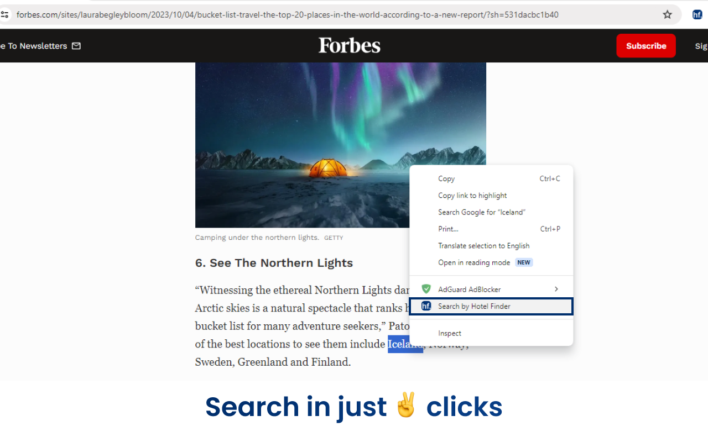
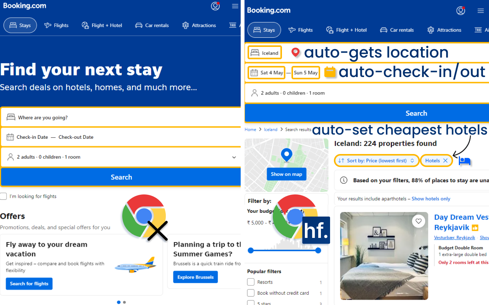

# Hotelfinder Extension

The Hotelfinder extension helps people search for the cheapest and most affordable hotels on Booking.com with just two clicks. It's a convenient tool for travelers who want to find accommodation quickly and easily while browsing the web.

## Features

- **Easy to Use:** Search for hotels with just two clicks.
- **Fast and Efficient:** Instantly redirects to the cheapest hotels for the selected location.
- **Seamless Integration:** Works directly from your browser's context menu.

## How It Works

1. **Select a Location:** When reading an article and you find a tourist spot, simply select the location name.
2. **Right-Click:** Right-click to open the context menu.
3. **Search by Hotel Finder:** Click on the "Search by Hotel Finder" option.
4. **Redirect:** You'll be redirected to Booking.com with the cheapest hotels searched for the specific location.

## Screenshots

*Right-click to see the "Search by Hotel Finder" option.*

*Redirected to Booking.com with the cheapest hotels searched for the specific location.*

## Installation

I am yet to add this extension to Chrome Web Store. Installation manual will be updated when extension goes live.

## Contributing

Feel free to submit issues or pull requests for any improvements or bugs you find.

## License

This project is licensed under the MIT License - see the [LICENSE](LICENSE) file for details.
